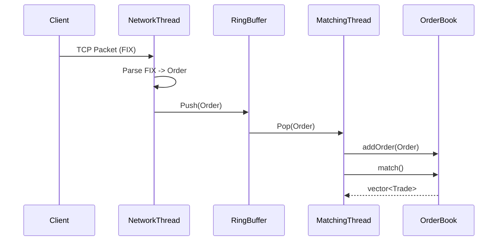

# System Architecture

## Design Philosophy
The system is designed for **low latency** and **determinism**.
1.  **Zero Allocations on Hot Path**: Once the system warms up, no memory is allocated during order processing.
2.  **Lock-Free Communication**: The network thread communicates with the matching engine via a Single-Producer Single-Consumer (SPSC) ring buffer.
3.  **Core Affinity**: (Planned) Threads will be pinned to specific CPU cores to maximize cache locality.

## Component Interaction

### 1. Network Layer (`TCPOrderGateway`)
*   **Role**: Accepts TCP connections and reads raw bytes.
*   **Thread**: Runs on a dedicated `IO Thread`.
*   **Logic**:
    *   Reads into a pre-allocated buffer.
    *   Calls `FIXParser` to extract fields.
    *   Constructs an `Order` object.
    *   Pushes `Order` to `LockFreeQueue`.
    *   *Crucial*: Does NOT block. If the queue is full, it yields (or drops in a real system).

### 2. The Bridge (`LockFreeQueue`)
*   **Role**: Safe data transfer between threads.
*   **Implementation**: A fixed-size `std::array` with atomic head/tail indices.
*   **Memory Ordering**: Uses `memory_order_acquire` / `memory_order_release` to ensure the matching engine sees the order data only after it's fully written.

### 3. Matching Engine (`main.cpp` loop)
*   **Role**: Processes orders and manages the book.
*   **Thread**: Runs on a dedicated `Matching Thread` (isolated from OS noise).
*   **Logic**:
    *   Pops `Order` from queue.
    *   Start Timer (`rdtsc`).
    *   Calls `OrderBook::addOrder()`.
    *   Calls `OrderBook::match()`.
    *   Stop Timer (`rdtsc`).
    *   Records latency.

### 4. Order Book (`IOrderBook`)
*   **Role**: Maintains the state of Bids and Asks.
*   **Current Implementation**: `MapOrderBook` (Baseline).
    *   Uses `std::map<Price, List<Order>>`.
    *   *Pros*: Simple, correct, ordered.
    *   *Cons*: Pointer chasing, cache misses, dynamic allocation (node creation).
*   **Future Implementations**:
    *   `SkipListOrderBook`: Better locality, probabilistic balancing.
    *   `ArrayOrderBook`: O(1) access, pre-allocated, best for dense price levels.

## Data Flow Diagram

