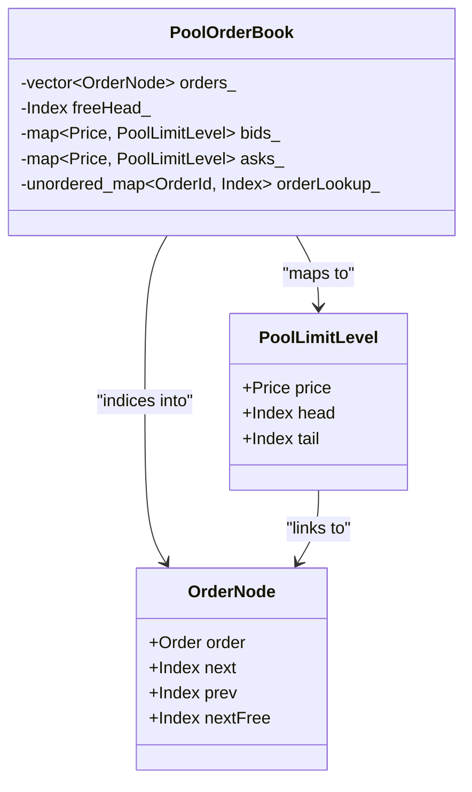

# OrderBook Benchmark Configuration

All tests are implemented in `benchmarks/orderbook_benchmark.cpp`.

## Test Implementations

### 5 OrderBook Implementations

- **ArrayOrderBook**: Fixed-size array, O(1) access, 5000-15000 price range
- **MapOrderBook**: Red-black tree, O(log n) access, unbounded prices
- **VectorOrderBook**: Dynamic array, O(1) reads but O(n) insertions
- **HybridOrderBook**: Combined vector + map, 20 hot price levels
- **PoolOrderBook**: Pre-allocated memory pool, O(1) alloc/dealloc, intrusive linked lists

#### PoolOrderBook Architecture



## Test Scenarios

### Market Pattern Scenarios

#### TightSpread

- **Price Range**: 9995-10005 (10 ticks)
- **Pattern**: Clustered around mid-price
- **Purpose**: Simulates active institutional trading

#### FixedLevels

- **Price Range**: 9991-10010 (20 fixed levels)
- **Pattern**: 99% of orders hit pre-existing price levels
- **Purpose**: VectorOrderBook optimal case

#### UniformRandom

- **Price Range**: 9000-11000 (2000 ticks)
- **Pattern**: Uniformly distributed random prices
- **Purpose**: Baseline average case

#### DenseFull

- **Price Range**: 9500-10500 (1000 ticks)
- **Pattern**: Dense orderbook, many price levels
- **Purpose**: Stress test orderbook depth

#### SparseExtreme

- **Price Range**: 5000-15000 (10000 ticks)
- **Pattern**: Extremely sparse, wide spread
- **Purpose**: Edge case testing

#### WorstCaseFIFO

- **Price Range**: 10000 (single price)
- **Pattern**: All orders at same price level
- **Purpose**: Maximum FIFO queue traversal

### Workload Pattern Scenarios

#### ReadHeavy90

- **Read Ratio**: 90% lookups (getBestBid/Ask)
- **Write Ratio**: 10% inserts (addOrder)
- **Purpose**: Market maker behavior simulation

#### WriteHeavy90

- **Read Ratio**: 10% lookups
- **Write Ratio**: 90% inserts
- **Purpose**: Aggressive trader behavior simulation

#### HighCancel50

- **Pattern**: 50% Add Order, 50% Cancel Order
- **Purpose**: High churn, stress tests memory recycling and map erasure
- **Relevance**: Crucial for PoolOrderBook validation

## Scalability Testing

### Order Counts

Tests run with 5 different orderbook sizes:

- 1,000 orders (1K)
- 5,000 orders (5K)
- 10,000 orders (10K)
- 50,000 orders (50K)
- 100,000 orders (100K)

## Performance Metrics

### Latency Measurements

- **Mean**: Average cycles per operation
- **StdDev**: Standard deviation (variance indicator)
- **P50**: Median latency
- **P95**: 95th percentile
- **P99**: 99th percentile
- **P999**: 99.9th percentile

### Timing Method

- **getCurrentTimeNs()**: `std::chrono::high_resolution_clock` — nanosecond resolution, portable across macOS and Linux
- **Note**: Not an x86 RDTSC cycle counter. For production HFT, `__builtin_ia32_rdtsc()` would be used instead.
- **Warmup**: 1000 iterations (not measured)

## Usage

```bash
# Build
cd build && make orderbook_benchmark

# Run all tests
./scripts/run_benchmark.sh
```
