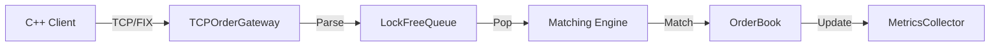

# HFT Orderbook Benchmark - Project Showcase

## Project Overview

This project is a high-performance trading system benchmark designed to evaluate different order book data structures (Map, SkipList, Array) and synchronization strategies (Spinlocks, RCU) under realistic load.

## Project Components

We migrated and adapted core components into a clean, benchmark-focused architecture.

### 1. Core Data Structures (`src/core`)

* **Order/Trade**: Refined for cache locality (packed structs).
* **IOrderBook**: Interface allowing hot-swapping implementations (Map vs SkipList) without changing the matching engine.

### 2. Networking Layer (`src/network`)

* **TCP Support**: Adapted from UDP sender to support reliable order entry.
* **FIX Parser**: Minimal parser handling `NewOrderSingle` messages with zero allocations where possible.
* **TCPOrderGateway**: Runs on its own thread and pushes orders to a lock-free queue.

### 3. Synchronization (`src/utils`)

* **LockFreeQueue**: SPSC queue adapted to pass orders from the Network Thread to the Matching Engine Thread without locking.
* **rdtsc**: Utility for nanosecond-precision latency measurements.

---

## System Architecture & Data Flow

### The "Hot Path" (Critical Latency Path)

This is the path every order takes. To understand the system, follow the data in this order:



### Code Reading Guide (Start Here)

If you want to understand the system from start to finish, read the files in this exact order:

#### 1. The Data (`src/core`)

* `Types.hpp`: See the basic types (`Price`, `Quantity`, `OrderId`).
* `Order.hpp`: The struct that moves through the system.
* `IOrderBook.hpp`: The interface that defines what an order book *is*.

#### 2. The Entry Point (`src/main.cpp`)

* See how the components are wired together.
* Notice the two main threads: `gateway.start()` (Network) and the `while(running)` loop (Matching Engine).

#### 3. The Network Layer (`src/network`)

* `TCPOrderGateway.cpp`: Accepts connections and reads raw bytes.
* `FIXParser.cpp`: The logic that turns `35=D|...` into an `Order` struct.

#### 4. The Bridge (`src/utils`)

* `LockFreeQueue.hpp`: The ring buffer that connects the two threads safely.

#### 5. The Engine (`src/orderbooks`)

* `MapOrderBook.cpp`: The actual matching logic. Look at `addOrder()` and `match()`.

---

## Build System (CMake) Explained

This project uses a **nested CMake structure** to keep components modular and reusable. Unlike a flat structure where everything is in one file, we split the build logic to mirror the directory structure.

### 1. The Root (`./CMakeLists.txt`)

This is the entry point. It sets global settings (like C++20 standard) and then delegates work to subdirectories.

```cmake
add_subdirectory(src)   # Go into 'src' and look for another CMakeLists.txt
add_subdirectory(tests) # Go into 'tests' and look for another CMakeLists.txt
```

### 2. The Source (`src/CMakeLists.txt`)

This is where the real work happens. We define a **Library** and an **Executable**.

#### The Core Library (`hft_core`)

Instead of compiling all `.cpp` files directly into `main`, we bundle the logic (OrderBook, Network, Utils) into a static library called `hft_core`.

```cmake
add_library(hft_core ...) # Bundles MapOrderBook.cpp, TCPOrderGateway.cpp, etc.
```

**Why?**

* **Reusability**: The `tests` folder can link against `hft_core` to test components without recompiling them.
* **Organization**: It separates "library logic" from "application entry point".

#### The Executable (`hft_exchange_server`)

This is the actual binary you run. It only contains `main.cpp` and links to the core library.

```cmake
add_executable(hft_exchange_server main.cpp)
target_link_libraries(hft_exchange_server PRIVATE hft_core) # Use the code from the library
```

### 3. Include Directories (`target_include_directories`)

We use `PUBLIC` include directories so that any target linking against `hft_core` automatically knows where to find the header files.

```cmake
target_include_directories(hft_core PUBLIC 
    ${CMAKE_CURRENT_SOURCE_DIR}       # Allows #include "network/TCPOrderGateway.hpp"
    ${CMAKE_CURRENT_SOURCE_DIR}/core  # Allows #include "Order.hpp" (if you wanted short paths)
)
```

---

## Benchmarking Results (Week 9)

We have established a baseline performance using `std::map` and a C++ TCP client.

| Metric          | Result                |
| :-------------- | :-------------------- |
| **Throughput**  | **~780,000 orders/s** |
| **P50 Latency** | **~475 cycles**       |
| **P99 Latency** | **~2,060 cycles**     |

*Note: Latency is measured from "Dequeued from Ring Buffer" to "Matching Complete". Network stack latency is excluded from this specific metric to focus on order book performance.*
